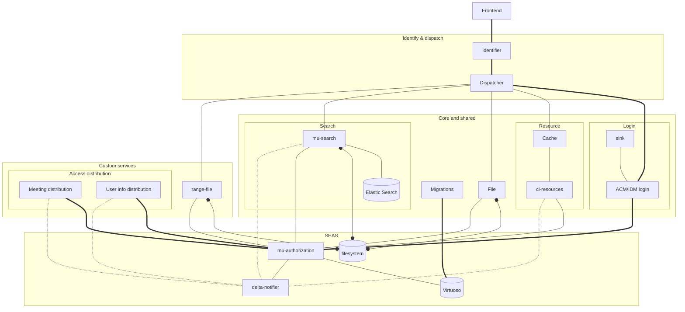

# Semantic.works

## Docker-Ember
### Install
A way to install [docker-ember](https://github.com/madnificent/docker-ember) without having to change your path, compliant with Linux directory standards (I think), and having it all neatly tucked away.
```bash
cd /usr/local/lib/
git clone https://github.com/madnificent/docker-ember.git
cd ../bin/
ln -s ../lib/docker-ember/bin/* .
```
Usually symbolic links are made using absolute paths, but in /usr/local/ it's not unheard of to use relative (npm, for example, does this).

### User namespace
To make sure all generated files aren't owned by root, edit `/etc/docker/daemon.json`
```json
{
  /* ... */
  "userns-remap": "username:group"
}
```
Alternatively, you can set the value to `default`, which then uses a user generated by Docker. This might especially be beneficial in production environments where security is key. Click [here](https://docs.docker.com/engine/security/userns-remap/) for more info.

You might have to run the following commands, especially if Docker throws `EACCES: permission denied, mkdir '...'`. Imported from [docker-ember docs](https://github.com/madnificent/docker-ember#1-create-the-correct-mapping-in-etcsubuid-and-etcsubgid).
```bash
echo "$( whoami ):$(id -u):65536" |  sudo tee -a /etc/subuid
echo "$( whoami ):$(id -g):65536" |  sudo tee -a /etc/subgid
```

You might have to restart the docker service using `systemctl restart docker.service`. If Docker fails to start, you can use `dockerd --debug`.


### Uninstall
```bash
cd /usr/local/bin/
rm ed edi edl eds
cd ../lib/
rm -rf docker-ember/
```


## Kaleidos diagram recreation
