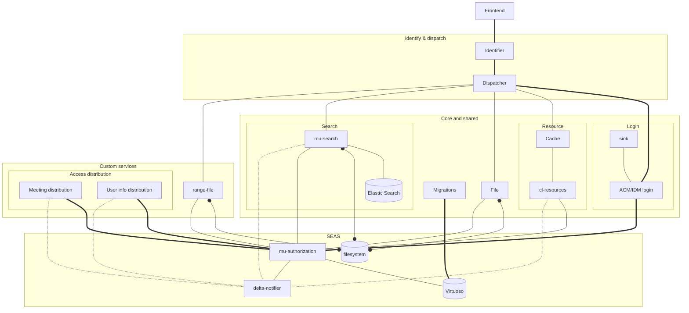

# Semantic.works
## Kaleidos diagram recreation

```mermaid
graph TD
    Frontend===Identifier
    subgraph Identify & dispatch
        Identifier===Dispatcher
    end
    subgraph Core and shared
        Migrations
        subgraph Login
            Dispatcher===acm[ACM/IDM login]
            sink---acm
        end
        subgraph Resource
            Dispatcher---Cache
            Cache---cl-resources
        end
        Dispatcher---File
        subgraph Search
            Dispatcher---mu-search
            mu-search---el[(Elastic Search)]
        end
    end

    subgraph Custom services
        Dispatcher---range-file
        subgraph Access distribution
            meeting[Meeting distribution]
            userinfo[User info distribution]
        end
    end

    subgraph SEAS

        File o--o filesystem[(filesystem)]
        mu-search o--o filesystem
        range-file o--o filesystem

        acm===auth
        File---auth
        mu-search---auth
        cl-resources---auth
        meeting===auth
        userinfo===auth
        range-file---auth


        meeting-.-delta-notifier
        userinfo-.-delta-notifier
        cl-resources-.-delta-notifier
        mu-search-.-delta-notifier

        auth[mu-authorization]---Virtuoso[(Virtuoso)]
        Migrations===Virtuoso
        
        auth---delta-notifier
    end
```